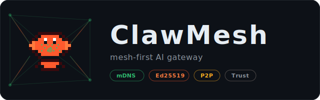

<p align="center">
  
</p>

<p align="center">
  <strong>Mesh-first AI gateway — stripped-down <a href="https://github.com/openclaw/openclaw">OpenClaw</a> fork for P2P mesh networking</strong>
</p>

<p align="center">
  <a href="#quickstart">Quickstart</a> &middot;
  <a href="#architecture">Architecture</a> &middot;
  <a href="#cli">CLI</a> &middot;
  <a href="#emergent-context-propagation">Context</a> &middot;
  <a href="#test-suite">Tests</a> &middot;
  <a href="#configuration">Config</a>
</p>

---

## What is ClawMesh?

ClawMesh makes a group of devices behave like **one distributed, capability-aware gateway**.

It strips OpenClaw's 43+ channel plugins, browser, TUI, media processing, and other heavy subsystems down to the mesh networking core:

| Kept | Stripped |
|------|---------|
| Mesh protocol (mDNS discovery, peer trust, forwarding) | All 43 channel plugins (Telegram, Discord, Slack, WhatsApp, ...) |
| Ed25519 device identity + mutual auth | Browser, canvas, TUI, cron, wizard |
| Capability-based routing (local-first, mesh fallback) | Media processing, TTS, link understanding |
| Peer registry + WebSocket connections | Auto-reply, hooks, plugin system |
| CLI for identity, trust, and status | Web UI, mobile apps, pairing |

## Why?

Most AI gateway stacks assume a single machine. That breaks when your capabilities are spread across devices:

- **Laptop** has your API keys and control surface
- **Desktop** has GPUs and local models
- **Jetson/Pi** has hardware sensors and edge inference
- **Server** has private network access

ClawMesh lets these discover each other via **mDNS**, establish **Ed25519 mutual trust**, and **route messages** to whichever peer has the right capability — all without a central coordinator.

## Quickstart

```bash
# Requirements: Node.js 22+, pnpm
pnpm install
pnpm test          # 62 tests across 6 files
pnpm typecheck     # tsc --noEmit
```

## Architecture

```
src/mesh/
  manager.ts              # Orchestrator: discovery, peer clients, registries
  discovery.ts            # mDNS polling with peer-discovered/peer-lost events
  capabilities.ts         # Capability registry (channel:*, skill:*)
  routing.ts              # Local-first routing: local caps -> mesh peers -> unavailable
  forwarding.ts           # RPC-based message forwarding between peers
  peer-trust.ts           # File-backed trust store with atomic writes
  peer-registry.ts        # Connected peer session tracking
  handshake.ts            # Ed25519 signed auth payloads
  context-types.ts        # ContextFrame types for emergent context
  context-propagator.ts   # Broadcast context frames to mesh peers
  world-model.ts          # Ingest and track mesh-wide knowledge
  mock-sensor.ts          # Mock sensor for testing context propagation
  server-methods/         # Gateway RPC handlers (peers, trust, forward)

src/infra/
  device-identity.ts      # Ed25519 key generation + deviceId derivation
  bonjour-discovery.ts    # mDNS/Avahi/dns-sd beacon scanning

src/cli/
  clawmesh-cli.ts         # Commander-based CLI

src/terminal/theme.ts     # Lobster palette theming (chalk)
```

### Routing Decision Flow

```
resolveMeshRoute("telegram", capabilityRegistry, localCapabilities)
  |
  |-- localCapabilities.has("channel:telegram")? --> { kind: "local" }
  |
  |-- capabilityRegistry.findPeerWithChannel("telegram")? --> { kind: "mesh", peerDeviceId }
  |
  \-- otherwise --> { kind: "unavailable" }
```

## CLI

```bash
clawmesh identity                     # Print device ID + public key
clawmesh trust list                   # List trusted peers
clawmesh trust add <deviceId>         # Trust a peer
clawmesh trust add <deviceId> --name "Jetson"
clawmesh trust remove <deviceId>      # Untrust a peer
clawmesh peers                        # List connected mesh peers
clawmesh status                       # Gateway + mesh status
clawmesh world                        # Query the world model
```

### Starting a Mesh Node

```bash
# Basic node
clawmesh start --name my-node --port 18789

# Node with mock sensor broadcasting context every 3s
clawmesh start --name sensor-node --port 18790 --mock-sensor --sensor-interval 3000

# Node with mock actuator for trust-gated commands
clawmesh start --name actuator-node --mock-actuator

# Connect to a static peer
clawmesh start --name observer --peer "<deviceId>=ws://192.168.1.39:18790"
```

### Connecting to Remote Gateways

```bash
# Connect to an OpenClaw gateway and save as named target
clawmesh gateway-connect --url ws://192.168.1.39:18789 --password secret --save jetson

# Reconnect using saved name
clawmesh gateway-connect jetson

# List saved gateway targets
clawmesh gateways
```

## Emergent Context Propagation

ClawMesh nodes build intelligence organically through continuous context gossip.

When a sensor on one node detects a state change, that **observation becomes context** — a `ContextFrame` that propagates across the mesh. Other nodes ingest this context into their **world model**, building a live picture of mesh-wide state. Planner LLMs can reason over this emergent knowledge and forward execution commands to nodes with the right capabilities.

### Example: Field Sensor -> Mesh Awareness -> Intelligent Execution

```
1. Jetson sensor detects low soil moisture in zone-1
2. Context propagates to mesh:
     { kind: "observation", zone: "zone-1", moisture: 15.2%, status: "critical" }
3. Mac planner LLM reasons over mesh-wide context
4. Mac forwards execution command: actuate:pump:P1
5. Jetson validates trust policy and starts pump
```

No file syncing. No manual coordination. Just emergent intelligence.

### Context Frame Types

| Kind | Description | Example |
|------|-------------|---------|
| `observation` | Sensor readings, measurements | Soil moisture 15.2% |
| `event` | Task completed, state change | Pump P1 started |
| `human_input` | Operator commands, notes | "Inspect pump P1" |
| `inference` | LLM-derived conclusions | "Zone 1 needs irrigation" |
| `capability_update` | Node capabilities changed | Node gained `actuator:pump` |

### Testing with Mock Sensor

```bash
# Terminal 1: Node broadcasting sensor context
clawmesh start --name sensor-node --port 18790 --mock-sensor --sensor-interval 3000

# Terminal 2: Observer node ingesting context
clawmesh start --name observer --port 18791 --peer "<sensor-deviceId>=ws://127.0.0.1:18790"
```

The observer's world model will log each ingested context frame:
```
[world-model] Ingested observation from sensor-node
```

## Test Suite

**62 tests, 6 files** — all built test-first with Red/Green TDD.

| File | Tests | What it covers |
|------|-------|----------------|
| `src/strip.test.ts` | 31 | Stripped directories don't exist |
| `src/strip-imports.test.ts` | 2 | No source file imports from 32 stripped modules |
| `src/mesh/smoke.test.ts` | 8 | All mesh modules import cleanly |
| `src/mesh/routing.test.ts` | 7 | Capability-based local-first routing |
| `src/cli/cli.test.ts` | 4 | CLI command structure |
| `src/mesh/integration.test.ts` | 10 | Routing + forwarding end-to-end |

```bash
pnpm test                              # Run all tests
pnpm vitest run src/mesh/              # Mesh tests only
```

## Configuration

Mesh config in your gateway YAML/JSON:

```yaml
mesh:
  enabled: true
  scanIntervalMs: 30000
  capabilities:
    - channel:telegram
    - skill:summarize
  peers:
    - url: wss://jetson.local:18789
      deviceId: sha256-of-peer-public-key
      tlsFingerprint: "sha256:..."
```

## Design Principles

- **Mesh-first**: Peer connectivity and forwarding are first-class primitives
- **Capability-driven**: Route by advertised capabilities, not hard-coded plugin lookups
- **Trust before traffic**: Discovered peers are ignored unless explicitly trusted
- **Local-first**: Always prefer local capabilities over mesh peers
- **Emergent intelligence**: Context gossip builds distributed awareness without central coordination
- **Lean core**: Small enough to reason about and deploy on edge devices

## Roadmap

- [x] Wire runnable `clawmesh start` gateway boot path
- [x] Emergent context propagation (ContextFrame, WorldModel, gossip)
- [x] Mock sensor for testing context broadcast
- [ ] Pi-mono LLM planner integration (context -> decision -> command)
- [ ] Real GPIO sensor integration (moisture, temperature, pressure)
- [ ] Build output + npm packaging for the `clawmesh` binary
- [ ] Multi-node end-to-end examples (discovery + trust + forwarding)
- [ ] Deployment docs for home lab / LAN setups
- [ ] Capability announcement protocol refinement

## License

MIT
