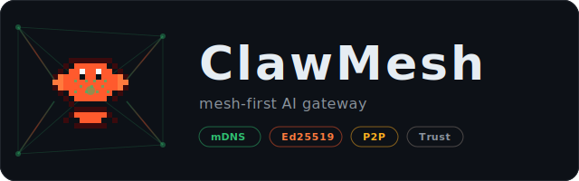

<p align="center">
  
</p>

<p align="center">
  <strong>Mesh-first AI gateway — stripped-down <a href="https://github.com/openclaw/openclaw">OpenClaw</a> fork for P2P mesh networking</strong>
</p>

<p align="center">
  <a href="#quickstart">Quickstart</a> &middot;
  <a href="#architecture">Architecture</a> &middot;
  <a href="#cli">CLI</a> &middot;
  <a href="#emergent-context-propagation">Context</a> &middot;
  <a href="#test-suite">Tests</a> &middot;
  <a href="#configuration">Config</a>
</p>

---

## What is ClawMesh?

ClawMesh makes a group of devices behave like **one distributed, capability-aware gateway**.

It strips OpenClaw's 43+ channel plugins, browser, TUI, media processing, and other heavy subsystems down to the mesh networking core:

| Kept | Stripped |
|------|---------|
| Mesh protocol (mDNS discovery, peer trust, forwarding) | All 43 channel plugins (Telegram, Discord, Slack, WhatsApp, ...) |
| Ed25519 device identity + mutual auth | Browser, canvas, TUI, cron, wizard |
| Capability-based routing (local-first, mesh fallback) | Media processing, TTS, link understanding |
| Peer registry + WebSocket connections | Auto-reply, hooks, plugin system |
| CLI for identity, trust, and status | Web UI, mobile apps, pairing |

## Why?

Most AI gateway stacks assume a single machine. That breaks when your capabilities are spread across devices:

- **Laptop** has your API keys and control surface
- **Desktop** has GPUs and local models
- **Jetson/Pi** has hardware sensors and edge inference
- **Server** has private network access

ClawMesh lets these discover each other via **mDNS**, establish **Ed25519 mutual trust**, and **route messages** to whichever peer has the right capability — all without a central coordinator.

## Usage & Setup Guides

- [Getting Started Guide](docs/getting-started.md)
- [Command Center Setup (Mac/PC)](docs/setup-command-center.md)
- [Field Node Setup (Jetson/Pi)](docs/setup-field-node.md)
- [Trust & Safety Policy](.pi/skills/mesh-safety.md)

## Quickstart

```bash
# Requirements: Node.js 22+, pnpm
pnpm install
pnpm test          # 118 tests across 15 files
pnpm typecheck     # tsc --noEmit
```

## Architecture

```
src/agents/
  pi-planner.ts           # Pi-powered intelligence — event-driven LLM planner
  farm-context-loader.ts  # Loads Bhoomi farm YAML → structured FarmContext
  types.ts                # Shared types: TaskProposal, ThresholdRule, FarmContext

src/mesh/
  node-runtime.ts         # Orchestrator: WebSocket server, peers, planner lifecycle
  discovery.ts            # mDNS polling with peer-discovered/peer-lost events
  capabilities.ts         # Capability registry (channel:*, skill:*)
  routing.ts              # Local-first routing: local caps -> mesh peers -> unavailable
  forwarding.ts           # RPC-based message forwarding between peers
  peer-trust.ts           # File-backed trust store with atomic writes
  peer-registry.ts        # Connected peer session tracking
  handshake.ts            # Ed25519 signed auth payloads
  context-types.ts        # ContextFrame types for emergent context
  context-propagator.ts   # Broadcast context frames to mesh peers
  world-model.ts          # Ingest and track mesh-wide knowledge
  mock-sensor.ts          # Mock sensor for testing context propagation
  mock-actuator.ts        # Mock actuator for trust-gated command testing
  server-methods/         # Gateway RPC handlers (peers, trust, forward)

src/infra/
  device-identity.ts      # Ed25519 key generation + deviceId derivation

src/cli/
  clawmesh-cli.ts         # Commander-based CLI
```

### Routing Decision Flow

```
resolveMeshRoute("telegram", capabilityRegistry, localCapabilities)
  |
  |-- localCapabilities.has("channel:telegram")? --> { kind: "local" }
  |
  |-- capabilityRegistry.findPeerWithChannel("telegram")? --> { kind: "mesh", peerDeviceId }
  |
  \-- otherwise --> { kind: "unavailable" }
```

## CLI

```bash
clawmesh identity                     # Print device ID + public key
clawmesh trust list                   # List trusted peers
clawmesh trust add <deviceId>         # Trust a peer
clawmesh trust add <deviceId> --name "Jetson"
clawmesh trust remove <deviceId>      # Untrust a peer
clawmesh peers                        # List connected mesh peers
clawmesh status                       # Gateway + mesh status
clawmesh world                        # Query the world model
```

### Starting a Mesh Node

```bash
# Basic node
clawmesh start --name my-node --port 18789

# Field node (sensors + actuators)
clawmesh start --name jetson-field-01 --port 18789 --field-node --sensor-interval 5000

# Command center (Pi planner with Anthropic Claude)
ANTHROPIC_API_KEY=sk-... clawmesh start --name mac-main --port 18790 \
  --command-center --peer "<deviceId>=ws://192.168.1.39:18789"

# Command center with Google Gemini
GOOGLE_API_KEY=... clawmesh start --name mac-main --port 18790 \
  --pi-planner --pi-model "google/gemini-2.5-flash" \
  --peer "<deviceId>=ws://192.168.1.39:18789"

# Command center with thinking enabled
clawmesh start --name mac-main --port 18790 --command-center \
  --thinking medium --peer "<deviceId>=ws://192.168.1.39:18789"
```

### Connecting to Remote Gateways

```bash
# Connect to an OpenClaw gateway and save as named target
clawmesh gateway-connect --url ws://192.168.1.39:18789 --password secret --save jetson

# Reconnect using saved name
clawmesh gateway-connect jetson

# List saved gateway targets
clawmesh gateways
```

## Emergent Context Propagation

ClawMesh nodes build intelligence organically through continuous context gossip.

When a sensor on one node detects a state change, that **observation becomes context** — a `ContextFrame` that propagates across the mesh. Other nodes ingest this context into their **world model**, building a live picture of mesh-wide state. Planner LLMs can reason over this emergent knowledge and forward execution commands to nodes with the right capabilities.

### Example: Field Sensor -> Mesh Awareness -> Intelligent Execution

```
1. Jetson sensor detects low soil moisture in zone-1
2. Context propagates to mesh:
     { kind: "observation", zone: "zone-1", moisture: 15.2%, status: "critical" }
3. Mac planner LLM reasons over mesh-wide context
4. Mac forwards execution command: actuate:pump:P1
5. Jetson validates trust policy and starts pump
```

No file syncing. No manual coordination. Just emergent intelligence.

### Context Frame Types

| Kind | Description | Example |
|------|-------------|---------|
| `observation` | Sensor readings, measurements | Soil moisture 15.2% |
| `event` | Task completed, state change | Pump P1 started |
| `human_input` | Operator commands, notes | "Inspect pump P1" |
| `inference` | LLM-derived conclusions | "Zone 1 needs irrigation" |
| `capability_update` | Node capabilities changed | Node gained `actuator:pump` |

### Testing with Mock Sensor

```bash
# Terminal 1: Node broadcasting sensor context
clawmesh start --name sensor-node --port 18790 --mock-sensor --sensor-interval 3000

# Terminal 2: Observer node ingesting context
clawmesh start --name observer --port 18791 --peer "<sensor-deviceId>=ws://127.0.0.1:18790"
```

The observer's world model will log each ingested context frame:
```
[world-model] Ingested observation from sensor-node
```

## Test Suite

**119 tests across 15 files** — built test-first to ensure networking robustness and correct intelligence wiring.

| Area | What it covers |
|------|----------------|
| `src/mesh/peer-registry.test.ts` | Connection tracking, event broadcasting |
| `src/mesh/capabilities.test.ts` | Dynamic capability advertising and lookups |
| `src/mesh/peer-trust.test.ts` | Ed25519 identity verification and local trust storage |
| `src/mesh/integration.test.ts` | End-to-end routing + forwarding between multiple nodes |
| `src/mesh/routing.test.ts` | Capability-based local-first routing rules |
| `src/mesh/forwarding.test.ts` | RPC payload construction and dispatch |
| `src/mesh/trust-policy.test.ts` | L0–L3 approval tiers and sensor evidence validation |
| `src/agents/planner.test.ts` | Farm context loading and task proposal types |

```bash
pnpm test                              # Run all tests
```

## Configuration

Mesh config in your gateway YAML/JSON:

```yaml
mesh:
  enabled: true
  scanIntervalMs: 30000
  capabilities:
    - channel:telegram
    - skill:summarize
  peers:
    - url: wss://jetson.local:18789
      deviceId: sha256-of-peer-public-key
      tlsFingerprint: "sha256:..."
```

## Design Principles

- **Mesh-first**: Peer connectivity and forwarding are first-class primitives
- **Capability-driven**: Route by advertised capabilities, not hard-coded plugin lookups
- **Trust before traffic**: Discovered peers are ignored unless explicitly trusted
- **Local-first**: Always prefer local capabilities over mesh peers
- **Emergent intelligence**: Context gossip builds distributed awareness without central coordination
- **Lean core**: Small enough to reason about and deploy on edge devices

## Roadmap

- [x] Wire runnable `clawmesh start` gateway boot path
- [x] Emergent context propagation (ContextFrame, WorldModel, gossip)
- [x] Mock sensor for testing context broadcast
- [x] Pi-mono LLM planner integration (pi-agent-core, multi-provider, event-driven)
- [x] Task proposal queue with approval levels (L0–L3)
- [x] Farm context injection from Bhoomi YAML data
- [ ] Real GPIO sensor integration (moisture, temperature, pressure)
- [ ] Build output + npm packaging for the `clawmesh` binary
- [ ] Multi-node end-to-end examples (discovery + trust + forwarding)
- [ ] Deployment docs for home lab / LAN setups
- [ ] Capability announcement protocol refinement

## License

MIT
