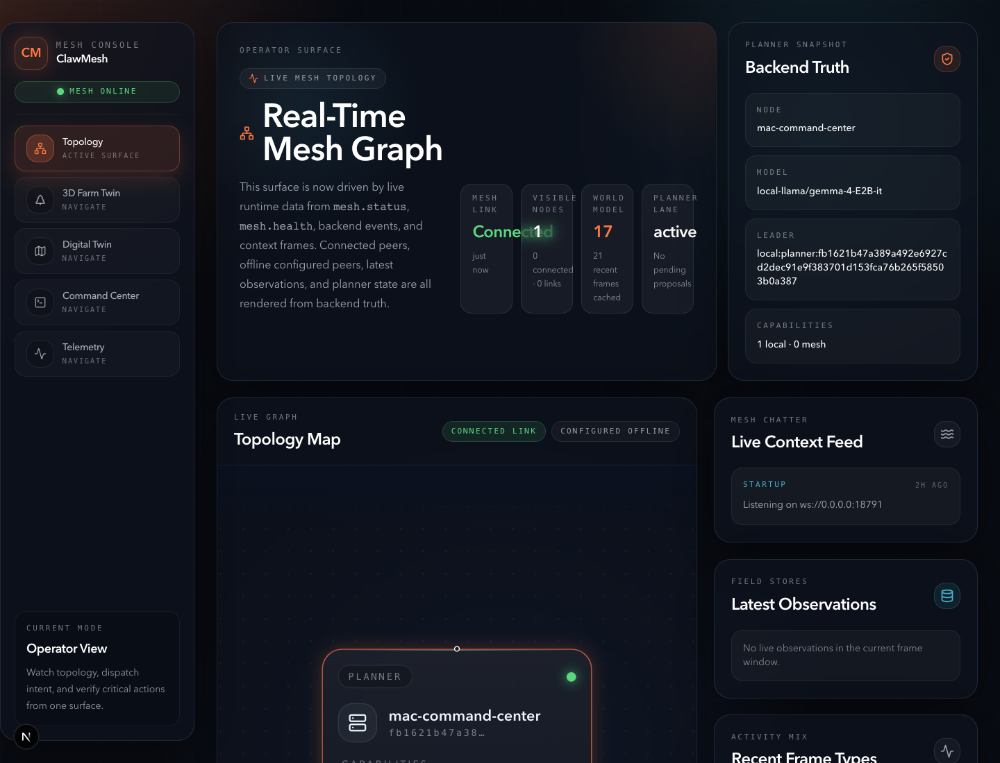
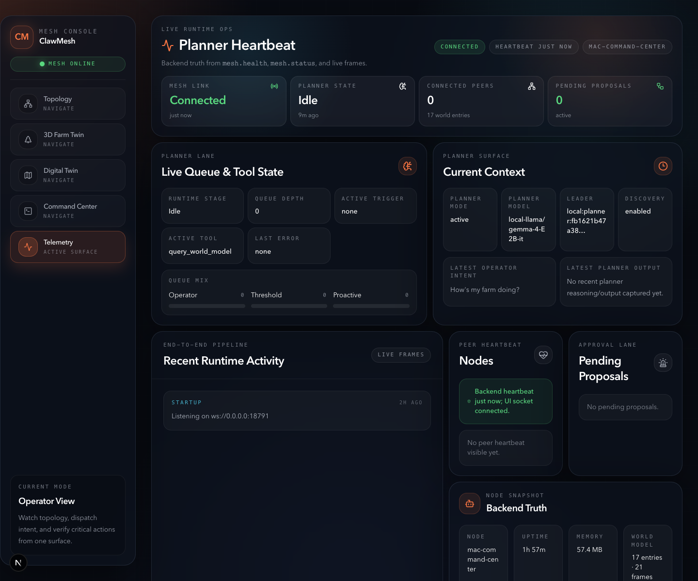
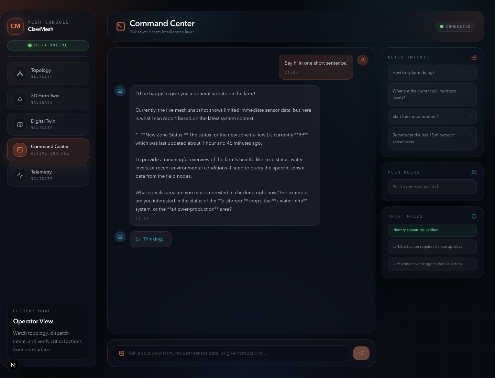
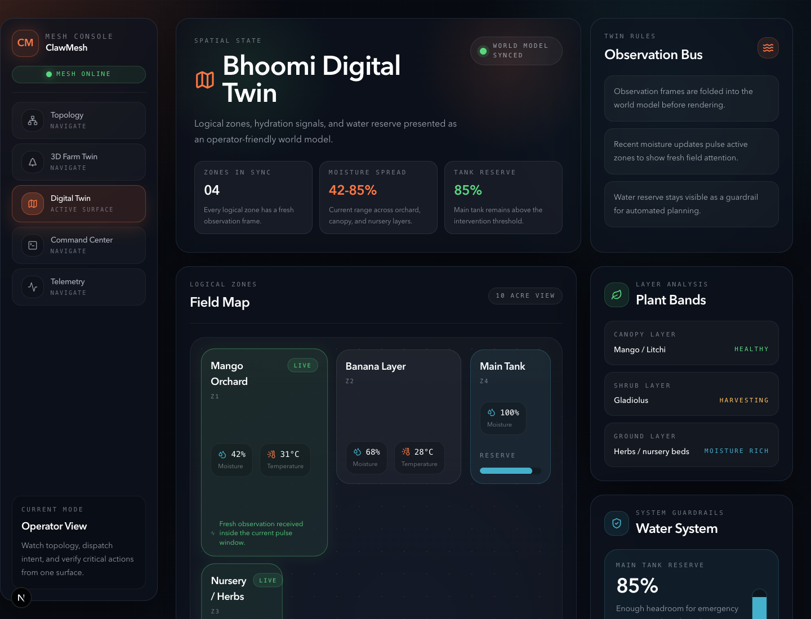
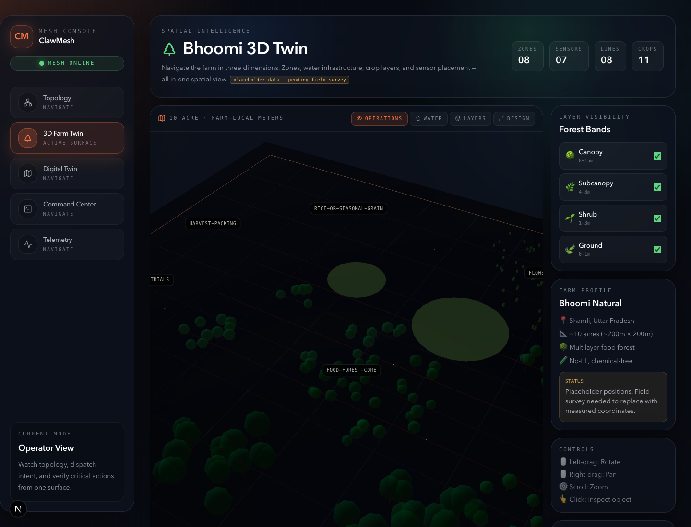
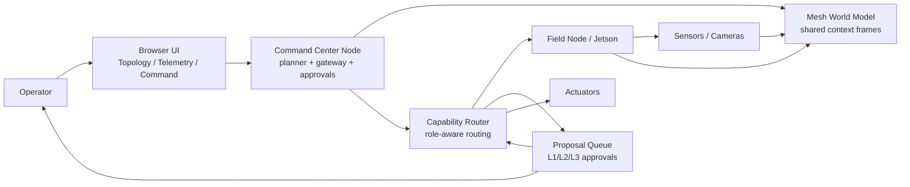
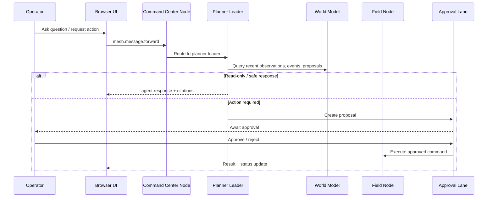

<p align="center">
  
</p>

<p align="center">
  <strong>Mesh-first distributed AI runtime for field operations, operator oversight, and safe execution.</strong>
</p>

<p align="center">
  ClawMesh turns a laptop, Jetson, sensors, actuators, and operator surfaces into one trust-gated, capability-aware runtime.
</p>

<p align="center">
  <a href="#screenshots">Screenshots</a> &middot;
  <a href="#the-problem-clawmesh-solves">Problem</a> &middot;
  <a href="#how-clawmesh-works">System Flow</a> &middot;
  <a href="#why-the-backend-looks-like-this">Architecture Choices</a> &middot;
  <a href="#quickstart">Quickstart</a> &middot;
  <a href="#trust-and-safety">Safety</a> &middot;
  <a href="#development">Development</a>
</p>

---

## Screenshots

These are real screenshots captured from the live local runtime in this repository.

<table>
  <tr>
    <td width="50%" valign="top">
      
      <p><strong>Topology</strong><br/>See what is connected, which node is leading, and what the mesh currently knows.</p>
    </td>
    <td width="50%" valign="top">
      
      <p><strong>Telemetry</strong><br/>Track planner heartbeat, queue/tool state, peer health, runtime events, and world-model truth.</p>
    </td>
  </tr>
</table>

<p align="center">
  
</p>

<p align="center">
  <strong>Command Center</strong> — Operators talk to the runtime, review outcomes, and keep approvals inside the same control surface.
</p>

<table>
  <tr>
    <td width="50%" valign="top">
      
      <p><strong>Digital Twin</strong><br/>An operator-friendly world model of logical zones, hydration state, and water-system guardrails.</p>
    </td>
    <td width="50%" valign="top">
      
      <p><strong>3D Farm Twin</strong><br/>A spatial twin for zones, water infrastructure, crop layers, and sensor placement. Current view uses placeholder survey geometry as the 3D model evolves.</p>
    </td>
  </tr>
</table>

---

## What is ClawMesh?

ClawMesh is a **distributed AI control-plane runtime** for systems that do not fit inside one process or one machine.

Typical real deployment:

- a **command-center laptop** hosts the planner, operator UI, approvals, and credentials
- a **Jetson or field node** hosts sensors, cameras, or actuators
- other nodes may host **models**, **private network access**, or **specialized capabilities**
- operators need one system that can **reason across all of it safely**

ClawMesh solves that by giving you:

- **device identity** with Ed25519 keys
- **trusted peer connections** across LAN or static/WAN links
- **capability-based routing** instead of host-by-host glue logic
- **shared context propagation** so the planner reasons over mesh state, not just local memory
- **proposal-based execution** so real actuation stays human-governed
- **operator-facing status surfaces** for topology, telemetry, command, and approvals

In short: ClawMesh is the runtime glue between distributed sensing, distributed planning, and safe distributed execution.

---

## The problem ClawMesh solves

Most AI + robotics / field-ops stacks break down in the same ways:

### 1. The system is physically distributed, but the software acts like it is not
A browser, a laptop planner, a Jetson, a sensor bus, and an actuator controller are often treated like one app with point-to-point hacks.

That causes:

- brittle host assumptions
- ad-hoc tunnels and proxies
- duplicated integration logic
- poor failover behavior

### 2. The planner does not have one trustworthy operational picture
Sensor data, approvals, operator instructions, and node health live in separate channels.

That causes:

- partial reasoning
- duplicate actions
- stale assumptions
- poor operator confidence

### 3. Real-world actuation needs stronger guarantees than chatbots provide
A useful planner should be able to reason and propose, but **LLM-only reasoning must not directly flip real hardware**.

That causes a design requirement, not a feature request:

- proposals
- approvals
- trust tiers
- evidence tracking
- enforcement on both sender and receiver

### 4. Operators need one place to observe and govern the runtime
Without good surfaces, teams cannot answer:

- what is the planner doing?
- why is it queued?
- which node is connected?
- which peer is stale?
- what proposal is pending?
- what changed recently?

ClawMesh is built to make those answers operationally obvious.

---

## How ClawMesh works

### High-level architecture


```mermaid
flowchart LR
    Operator[Operator]
    Browser[Browser UI\nTopology / Telemetry / Command]
    CC[Command Center Node\nplanner + gateway + approvals]
    WM[Mesh World Model\nshared context frames]
    Router[Capability Router\nrole-aware routing]
    Field[Field Node / Jetson]
    Sensors[Sensors / Cameras]
    Actuators[Actuators]
    Props[Proposal Queue\nL1/L2/L3 approvals]

    Operator --> Browser
    Browser --> CC
    CC --> WM
    CC --> Router
    Router --> Field
    Field --> Sensors
    Router --> Props
    Props --> Operator
    Props --> Router
    Router --> Actuators
    Sensors --> WM
    Field --> WM
```

### Operator intent flow


```mermaid
sequenceDiagram
    participant O as Operator
    participant UI as Browser UI
    participant CC as Command Center Node
    participant P as Planner Leader
    participant WM as World Model
    participant F as Field Node
    participant A as Approval Lane

    O->>UI: Ask question / request action
    UI->>CC: mesh.message.forward
    CC->>P: Route to planner leader
    P->>WM: Query recent observations, events, proposals
    alt Read-only / safe response
        P-->>UI: agent response + citations
    else Action required
        P->>A: Create proposal
        A-->>O: Await approval
        O->>A: Approve / reject
        A->>F: Execute approved command
        F-->>UI: Result + status update
    end
```

### The important operational idea

The browser is not the backend.

ClawMesh is designed so the browser can talk to a **local command-center node**, and that node can safely route work into the mesh. That keeps credentials, trust, peer logic, and approvals in the runtime instead of leaking them into the browser.

---

## Why the backend looks like this

This backend is not an arbitrary pile of technologies. Each major piece exists because it solves a specific failure mode seen in real multi-device systems.

### Problem-driven architecture choices

| Problem in real deployments | Architectural choice in ClawMesh | Why this choice exists |
|---|---|---|
| Devices should not trust random peers just because they can see them | **Ed25519 identity + trusted peer store** | Gives each device a stable identity and lets operators explicitly decide trust |
| Hostnames and fixed topologies break as devices move or change roles | **Capability-based routing + explicit roles** | Work is routed to what a node can do, not where someone hard-coded it |
| LAN deployments want simplicity; WAN deployments need explicit safety | **mDNS discovery + static peer mode + transport labels + TLS posture** | Lets local networks stay easy while making WAN connections visible, intentional, and enforceable |
| Planner reasoning should span multiple nodes, not one local process | **Context propagation + world model** | Shares observations, events, human input, and planner output across the mesh |
| Multi-planner meshes need deterministic behavior | **Planner election + leader-aware forwarding** | Prevents split-brain operator handling and lays groundwork for HA |
| A browser should not connect directly to every field node | **Command-center gateway node** | Keeps trust, routing, credentials, and policy in the runtime rather than in the browser |
| LLMs are useful for planning but unsafe as direct actuator controllers | **Proposal workflow + trust tiers + approval levels** | Forces high-risk operations through human-governed execution paths |
| Operators need runtime truth, not demo UI | **mesh.status / mesh.health / mesh.peers / mesh.events + live UI** | Makes the system observable in terms operators actually need |
| Stale peers and flaky links can poison distributed behavior | **Peer lifecycle handling + reachability confirmation + dead-peer suppression** | Prevents ghost reconnects, bad peer.down reports, and duplicate lifecycle churn |

### Backend pieces and the problem they solve

#### 1. `src/infra/device-identity.ts` + trust store
**Problem:** “How do I know this is really my Jetson and not just something on the network?”

**Solution:** Each node has a persistent Ed25519 identity. Peers are explicitly trusted and persisted locally.

**Operator value:** You can reason about the mesh in terms of actual devices, not anonymous sockets.

#### 2. `src/mesh/discovery.ts` + static peer configuration
**Problem:** “LAN should be easy, WAN should be explicit.”

**Solution:** Local meshes can auto-discover with mDNS. WAN/static mode disables discovery and uses explicit peers with transport labeling and posture reporting.

**Operator value:** You can choose convenience for LAN, determinism for WAN, and see exactly what transport the system is using.

#### 3. `src/mesh/capabilities.ts` + capability router
**Problem:** “I do not want to wire every action to a specific host forever.”

**Solution:** Nodes advertise capabilities, and the runtime routes based on capability and role.

**Operator value:** Adding or moving a node does not force a rewrite of every control path.

#### 4. `src/mesh/context-propagator.ts` + world model
**Problem:** “The planner is blind if state is fragmented across nodes.”

**Solution:** Observations, events, human inputs, and planner outputs are propagated as frames and ingested into a mesh-wide world model.

**Operator value:** The planner can answer based on real shared state, and telemetry can show what the runtime actually knows.

#### 5. `src/agents/pi-session.ts`
**Problem:** “The planner needs queueing, mode control, tool calls, error handling, and safe integration with the mesh.”

**Solution:** `PiSession` wraps the planner session, trigger queue, proactive checks, tool execution, and broadcast path.

**Operator value:** You can see when the planner is idle, queued, thinking, or inside a tool call, instead of treating it like a black box.

#### 6. Proposal lifecycle (`src/agents/proposal-*.ts`)
**Problem:** “Reasoning is not execution.”

**Solution:** The planner proposes work, approvals are explicit, ownership is tracked, and decisions are observable.

**Operator value:** Human approval becomes part of the runtime, not a side conversation.

#### 7. `src/mesh/node-runtime.ts`
**Problem:** “Someone has to orchestrate identity, peers, RPCs, context, UI events, proposals, and health surfaces coherently.”

**Solution:** The node runtime is the control-plane orchestrator for a ClawMesh node.

**Operator value:** The system has one consistent runtime contract whether it is running as planner, field node, or viewer/gateway.

#### 8. UI-backed runtime observability
**Problem:** “Dashboards often lie because they are disconnected from backend truth.”

**Solution:** The UI polls and subscribes to backend runtime surfaces and live context frames.

**Operator value:** Refresh-safe telemetry, live topology, and command-center state reflect the real runtime instead of mock cards.

---

## Core capabilities

### Mesh runtime
- trusted LAN peer discovery via mDNS
- static peer configuration for WAN or discovery-disabled deployments
- stable mesh identity and protocol-generation validation
- explicit node roles: `planner`, `field`, `sensor`, `actuator`, `viewer`, `standby-planner`, `node`
- peer lifecycle handling for graceful leave, hard down, reachability confirmation, and dead-peer suppression

### Intelligence and control
- Pi-powered planner integration
- proposal-based execution flow with approval levels
- mesh-wide world model from propagated context frames
- planner ownership and leadership groundwork
- leader-aware command-center forwarding

### Safety and trust
- Ed25519 mutual identity
- trusted peer store
- actuation trust tiers (T0-T3)
- approval levels (L0-L3)
- hard block on LLM-only physical actuation

### Operator experience
- web UI for topology, command, telemetry, and twins
- CLI status, trust, identity, and admin operations
- Telegram interface for status and approvals
- TUI support
- machine-readable runtime surfaces via `mesh.status`, `mesh.health`, `mesh.peers`, and `mesh.events`

### WAN/static deployment hardening
- discovery-disabled static mode
- transport labels such as `relay`, `vpn`, `lan`, `local`, `mdns`
- URL normalization from `http(s)` to `ws(s)`
- startup diagnostics for insecure or unpinned WAN links
- posture surfaced in health, status, logs, and operator views
- WAN enforcement for non-local transports while keeping explicit local labels permissive

---

## Quickstart

### Requirements

- Node.js
- `pnpm`
- a sibling checkout of `../pi-mono` for the current local `file:` dependencies in this repo

Optional but commonly needed:

- provider API keys for planner usage
- Telegram bot token if using Telegram

### Install

```bash
pnpm install
pnpm typecheck
pnpm test
```

### Running from a source checkout

If `clawmesh` is not installed on your PATH yet, use:

```bash
pnpm exec tsx clawmesh.ts <command>
```

The examples below use `clawmesh` for readability. In a source checkout, replace that with `pnpm exec tsx clawmesh.ts`.

### Minimal single-node runtime

```bash
clawmesh start --name dev-node --capability channel:clawmesh
```

### Command center with planner + browser UI

Start the runtime:

```bash
clawmesh start \
  --name ops-main \
  --role planner \
  --command-center \
  --pi-model anthropic/claude-sonnet-4-5-20250929
```

Start the web UI:

```bash
cd ui
pnpm install
pnpm dev
```

### Field node with mock sensor + mock actuator

```bash
clawmesh start \
  --name field-jetson \
  --role field \
  --field-node \
  --mock-sensor \
  --mock-actuator
```

### Query a running node

```bash
clawmesh status --url ws://localhost:18789
clawmesh status --url ws://localhost:18789 --events
clawmesh peers
clawmesh world
```

---

## A practical deployment pattern

A deployment pattern that fits this repository well is:

### Mac command center
- planner leader
- browser UI host
- approvals / operator surface
- local model or remote provider

### Jetson field node
- field role
- sensors / cameras / actuators
- no direct browser dependency
- connects outbound to the Mac command center

That gives you a clean operational split:

- browser talks to Mac
- Mac talks to mesh
- Jetson contributes field capabilities
- trust and approvals stay in the runtime

---

## Deployment patterns

### 1. LAN / zero-config discovery

```bash
clawmesh start --name edge-a --capability sensor:mock
clawmesh start --name edge-b --capability channel:clawmesh
```

Use this when nodes share a local network and you want trusted peers to auto-connect.

### 2. Static / WAN / discovery-disabled mode

```bash
clawmesh start \
  --name wan-node \
  --no-discovery \
  --peer "<deviceId>=https://relay.example.com/mesh|sha256:ABCDEF...|relay"
```

Use this when peers are not on the same LAN or when you want deterministic startup and explicit connection intent.

### 3. Stable named mesh

```bash
clawmesh start --name ops-main --mesh-name bhoomi-prod --role planner
clawmesh start --name field-jetson --mesh-name bhoomi-prod --role field
```

This helps reject accidental cross-mesh joins.

### 4. Roles

Common patterns:

- `planner` — primary planning node
- `standby-planner` — HA groundwork / hot standby role
- `field` — mixed edge node with sensors and actuators
- `sensor` — read-focused node
- `actuator` — execution-focused node
- `viewer` — passive observer that does not affect routing

---

## Static peer format

Static peers are passed with `--peer`.

```text
<deviceId>=<url>|<tlsFingerprint>|<transportLabel>
```

Where:

- `deviceId` is the trusted peer device ID
- `url` may be `ws://`, `wss://`, `http://`, or `https://`
- `tlsFingerprint` is optional for local peers, but required for WAN-safe labeled peers
- `transportLabel` is optional but strongly recommended for non-LAN peers

Examples:

```bash
clawmesh start --peer "<deviceId>=ws://10.0.0.5:18789||lan"
```

```bash
clawmesh start --no-discovery \
  --peer "<deviceId>=https://relay.example.com/mesh|sha256:ABCDEF...|relay"
```

```bash
clawmesh start --no-discovery \
  --peer "<deviceId>=wss://vpn.example.com/mesh|sha256:ABCDEF...|vpn"
```

---

## Trust and safety

ClawMesh is opinionated here because field systems need stronger guarantees than general chat systems.

### Peer trust

Peers are not trusted just because they are visible.

```bash
clawmesh trust add <deviceId>
clawmesh trust list
clawmesh trust remove <deviceId>
```

Trusted peers are persisted in:

```text
~/.clawmesh/mesh/trusted-peers.json
```

### Evidence trust tiers

| Tier | Meaning |
|---|---|
| `T0` | planning inference |
| `T1` | unverified observation |
| `T2` | operational observation |
| `T3` | verified action evidence |

### Approval levels

| Level | Meaning |
|---|---|
| `L0` | safe read-only |
| `L1` | bounded auto-execute |
| `L2` | human approval required |
| `L3` | strongest verification / on-site style control |

### Critical safety rule

**LLM-only evidence is hard-blocked from physical actuation.**

That means the planner can:

- reason
- summarize
- route
- propose
- explain

But it cannot unilaterally trigger real-world actuation without the required trust and approval evidence.

---

## Operator surfaces

### Topology
Answers:

- what nodes exist?
- who is connected?
- what does the runtime know right now?

### Telemetry
Answers:

- what is the planner doing?
- is it queued, thinking, or inside a tool call?
- what changed recently?
- how healthy is the runtime?

### Command Center
Answers:

- how does an operator talk to the system?
- what did the planner say?
- what proposals need review?

### CLI
Useful commands:

```bash
clawmesh identity
clawmesh start
clawmesh status --url ws://localhost:18789 --events
clawmesh trust list
clawmesh credential list
clawmesh gateway-connect --url ws://192.168.1.39:18789
clawmesh gateways
```

### Telegram

```bash
clawmesh start --command-center --telegram --telegram-chat <chatId>
```

Telegram supports:

- `/status`
- `/world`
- `/proposals`
- `/approve <id>`
- `/reject <id>`
- `/alerts`

### TUI

```bash
clawmesh start --command-center --tui
```

The TUI gives you peers, context activity, proposals, planner state, and interactive command input in the terminal.

---

## Observability

ClawMesh exposes runtime state through:

- `mesh.peers`
- `mesh.status`
- `mesh.health`
- `mesh.events`
- startup diagnostics
- connection and error logs

Current operator-visible details include:

- discovery mode
- connected peers
- configured static peers
- transport labels
- static peer security posture (`insecure`, `tls-unpinned`, `tls-pinned`)
- planner activity and leader context
- planner queue/tool state

This is especially useful in WAN/static deployments, where operators need to answer:

> “What did this node think it should connect to, what is it doing now, and how safe is that path?”

---

## Architecture at a glance

### Runtime core
- `src/mesh/node-runtime.ts` — node orchestrator
- `src/mesh/peer-connection-manager.ts` — outbound peer lifecycle
- `src/mesh/peer-client.ts` / `src/mesh/peer-server.ts` — WebSocket transport
- `src/mesh/discovery.ts` — mDNS discovery
- `src/mesh/server-methods/` — RPC handlers

### Intelligence layer
- `src/agents/pi-session.ts` — planner/session integration
- `src/agents/extensions/` — mesh tools and operator commands
- `src/agents/proposal-*.ts` — proposal lifecycle and formatting

### Channels and UI
- `src/channels/telegram.ts` — Telegram bridge
- `src/tui/` — terminal dashboard
- `ui/` — browser dashboard

### State and identity
- `src/infra/device-identity.ts` — Ed25519 identity
- `src/mesh/peer-trust.ts` — trusted peer store
- `src/infra/credential-store.ts` — credential persistence

---

## State and file locations

By default ClawMesh stores local state under:

```text
~/.clawmesh
```

Override with:

```bash
export CLAWMESH_STATE_DIR=/path/to/custom/state
```

Important files:

| Path | Purpose |
|---|---|
| `~/.clawmesh/identity/device.json` | local Ed25519 identity |
| `~/.clawmesh/credentials.json` | provider/channel credentials |
| `~/.clawmesh/mesh/trusted-peers.json` | trusted peer store |
| `~/.clawmesh/mesh/gateways.json` | saved gateway targets |
| `~/.clawmesh/mesh/patterns.json` | learned operator patterns |
| `~/.clawmesh/world-model-snapshot.json` | world-model snapshot for restart recovery |

---

## Current status and important realities

ClawMesh is a serious working codebase under active hardening, but it is not yet a finished packaged product.

Important current realities:

- the runtime and safety model are real and actively tested
- WAN/static deployment support includes transport labeling, posture reporting, and enforcement for WAN-style links
- the browser UI is tied to real runtime surfaces rather than mock cards
- the package is **not yet published to npm**
- the current checkout still expects local `file:` dependencies from a sibling `../pi-mono`

So today this repo is best treated as:

- production-minded engineering work
- actively usable for development and field experiments
- still evolving in packaging and final deployment ergonomics

---

## Credential management

```bash
clawmesh credential set provider/google <api-key>
clawmesh credential set provider/anthropic <api-key>
clawmesh credential set channel/telegram <bot-token>
clawmesh credential list
clawmesh credential get provider/google
```

Stored provider credentials are injected into `process.env` on startup so the planner can use them without manually exporting each variable.

---

## Development

### Common commands

```bash
pnpm install
pnpm typecheck
pnpm test
```

### Targeted test runs

```bash
pnpm exec vitest run src/mesh/
pnpm exec vitest run src/agents/
pnpm exec vitest run src/channels/
pnpm exec vitest run src/cli/
```

### Notes for contributors

- prefer small, test-backed slices
- mesh reliability changes are developed Red/Green
- existing trust/safety constraints should not be weakened casually
- WAN/static behavior should stay explicit and operator-visible
- browser UI should prefer backend truth over mock/demo-only state

---

## Setup guides and docs

- [Getting Started Guide](docs/getting-started.md)
- [Command Center Setup](docs/setup-command-center.md)
- [Field Node Setup](docs/setup-field-node.md)
- [Bhoomi Farm Twin Spec](docs/bhoomi-farm-twin-spec-v0.md)
- [Mesh Safety Skill / Policy Context](.pi/skills/mesh-safety/SKILL.md)

---

## License

MIT
